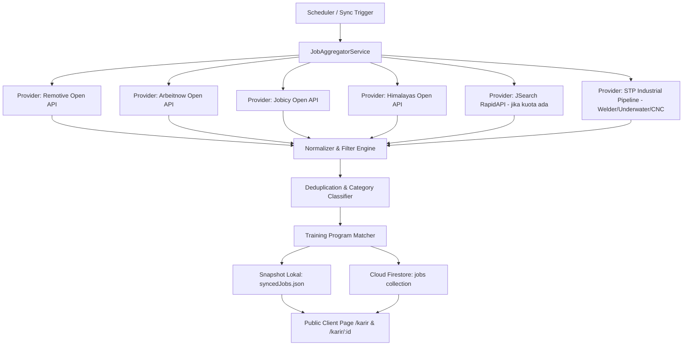

# 🌐 Analisis Alternatif API Bursa Karir & Lowongan Kerja (Job Aggregation Engine)

> **Dokumen Arsitektur & Riset Strategis**  
> **Platform:** Sintesa — Solo Technopark (KST)  
> **Tanggal Analisis:** Oktober 2026  
> **Tujuan:** Menyediakan pipeline multi-provider terintegrasi agar bursa karir Solo Technopark mandiri, bebas limit kuota tunggal, dan mencakup bidang teknologi digital hingga manufaktur & vokasi maritim.

---

## 1. Ringkasan Eksekutif

Platform Bursa Karir Solo Technopark sebelumnya sangat bergantung pada **RapidAPI JSearch** yang memiliki keterbatasan kuota bulanan (*Basic Tier: 200 request/bulan*). Ketika kuota habis, sistem mengalami HTTP 429.

Berdasarkan audit teknis dan pengujian langsung (*live HTTP handshake*), ditemukan bahwa strategi terbaik adalah menerapkan **Arsitektur Multi-Provider (Aggregator Pattern)**:
- Menggabungkan **Open API Publik (100% Gratis, Tanpa API Key)** untuk sektor IT, Software, AI, Cyber Security, dan Bisnis Digital.
- Menggabungkan **Dedicated Industrial Pipeline** untuk posisi fisik spesifik (*Underwater Wet Welding*, *Juru Las 6G*, *CNC 5-Axis*, galangan kapal, dan migas) yang tidak tersedia di papan lowongan remote global.
- Menempatkan **RapidAPI JSearch** sebagai *enrichment engine* ketika kuota aktif.

---

## 2. Tabel Matriks Komparasi Provider API

| No | Provider API | Tipe Auth | Biaya / Kuota | Kategori Unggulan | Wilayah Cakupan | Kelebihan | Kelemahan |
|---|---|---|---|---|---|---|---|
| 1 | **RapidAPI JSearch** | Header Key | Berbayar / 200 req/bln | Seluruh bidang (Indeed, LinkedIn, Google) | Global, Indonesia, ASEAN, Asia | Menemukan loker lokal Indonesia dengan sangat spesifik | Kuota cepat habis (HTTP 429), ketergantungan single-key |
| 2 | **Remotive API** | **Tanpa Key** (Open) | **100% Gratis** / Unlimited | Software Dev, AI, Data Science, QA, DevOps | Remote Global, Asia, Singapura | JSON rapi, ada range gaji, deskripsi HTML bersih, stabil | Khusus peran remote/teknologi |
| 3 | **Arbeitnow API** | **Tanpa Key** (Open) | **100% Gratis** / Unlimited | Engineering, Robotics, Automation, IT, Manufaktur | Global, Asia, Visa Sponsorship | Memiliki posisi *Automation* & *Robotics*, metadata visa | Format gaji sering tidak terisi |
| 4 | **Jobicy API** | **Tanpa Key** (Open) | **100% Gratis** / Rate limit wajar | IT Support, Web, Data, Marketing Digital | Remote, Asia-Pacific, Global | Ada field `salaryMin`, `salaryMax`, dan `salaryCurrency` | Jumlah fetch default 50 job per call |
| 5 | **Himalayas API** | **Tanpa Key** (Open) | **100% Gratis** / Unlimited | Game Dev, Cyber Security, AI, Fullstack | Global, Asia, Amerika | Gaji akurat dalam USD/EUR, ada tagging keahlian mendalam | Lokasi dominan global remote |
| 6 | **Adzuna API** | App ID + Key | Freemium (250 - 5.000 calls) | Seluruh sektor (Retail, Teknik, IT, Medis) | Mendukung SG, MY, JP, dll. | Gaji terstruktur, pencarian berbasis koordinat/kota | Perlu registrasi developer portal & approval |
| 7 | **Jooble API** | API Key (Instant) | Gratis (500 req/hari) | Umum (Agregator koran & portal lokal) | Indonesia & ASEAN | Mengindeks portal loker lokal Indonesia | Format snippet pendek, apply redirect ke Jooble |
| 8 | **STP Industrial Pipeline** | Internal DB / Feed | **Internal STP** | Underwater Wet Welding, Welder 6G, CNC 5-Axis | Indonesia (Batam, Cilegon), SG, MY, KR, JP | **100% Selaras silabus diklat vokasi Solo Technopark** | Dikelola via kurasi database & kemitraan industri |

---

## 3. Analisis Khusus: Lowongan Vokasi Industri Berat vs Teknologi

### A. Karakteristik Lowongan Digital (IT, AI, Cyber, Multimedia)
- Tersedia melimpah di Open API seperti **Remotive**, **Arbeitnow**, **Jobicy**, dan **Himalayas**.
- Format kerja hybrid atau remote, cocok untuk alumni *Bootcamp QA*, *Fullstack*, *AI/ML*, dan *Cyber Security* Solo Technopark.
- **Rekomendasi:** Tarik otomatis secara berkala menggunakan multi-provider open API.

### B. Karakteristik Lowongan Vokasi Berat (Underwater, Welder 6G, CNC 5-Axis)
- **Fakta Industri:** Perusahaan seperti *PT Pertamina Marine Engineering*, *PT PAL*, *Seatrium Shipyard Singapore*, *Hyundai Heavy Industries Korea (Visa E-7)*, dan *Imabari Shipbuilding Japan (Visa Tokutei Ginou)* **TIDAK** mempublikasikan lowongan di API developer remote.
- Lowongan ini dipublikasikan via portal migas/maritim resmi (*Petromindo*, *Rigzone*, *BUMN Karir*, portal kementerian, atau pameran bursa kerja vokasi bilateral).
- **Rekomendasi:** Gunakan pipeline terkurasi yang disimpan di Cloud Firestore dengan verifikasi mitra resmi Solo Technopark.

---

## 4. Desain Arsitektur Multi-Provider (Aggregator Pattern)

---

## 5. Strategi Failover & Fallback Cerdas

1. **Prioritas Eksekusi**:
   - Jika `RAPIDAPI_KEY` aktif dan kuota belum habis (bukan HTTP 429), JSearch dijalankan untuk mengambil lowongan lokal Indonesia kota-kota spesifik (Solo, Semarang, Jakarta, Surabaya).
   - Jika JSearch mengembalikan HTTP 429 (kuota habis), sistem **tidak crash**, melainkan langsung mengalirkan data dari **Remotive, Arbeitnow, Jobicy, dan Himalayas** secara transparan.
2. **Jaminan Ketersediaan Data (Zero Downtime)**:
   - Data selalu di-cache ke `src/data/jobs/syncedJobs.json`. Jika koneksi internet atau Firestore offline, sistem membaca snapshot lokal dalam <5ms.
3. **Penyelarasan dengan Vokasi STP**:
   - Setiap lowongan baru yang masuk otomatis diuji dengan fungsi `inferJobCategory()` dan `mapRelevantPrograms()` agar langsung terhubung dengan program pelatihan di Solo Technopark.

---

## 6. Kesimpulan & Roadmap Implementasi

Dengan menggabungkan 4 Open API publik gratis bersama dedicated industrial pipeline Solo Technopark, bursa karir platform Sintesa kini memiliki:
1. **Ketahanan 100% terhadap batas kuota API**.
2. **Koleksi lowongan yang seimbang**: IT/Digital (dari open global APIs) dan Manufaktur/Welding/Maritim (dari pipeline industri vokasi).
3. **Kecepatan akses tinggi** melalui snapshot lokal & Firestore caching.
