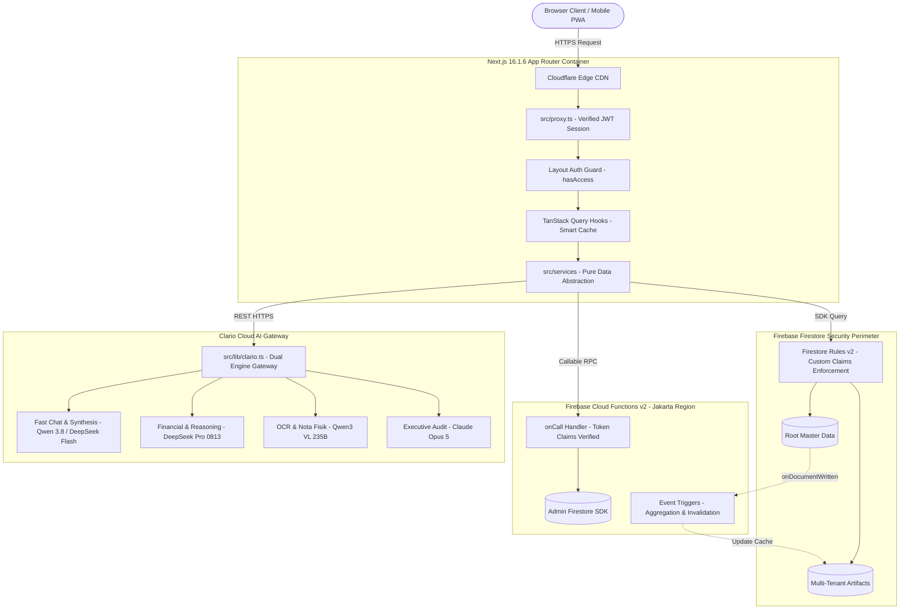
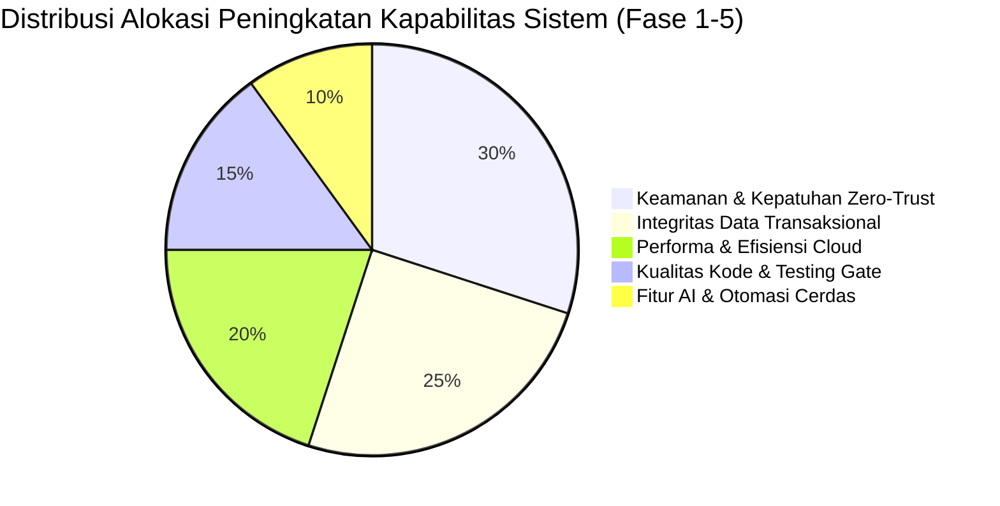

# 📋 BLUEPRINT & AUDIT ARSITEKTUR SISTEM SINTESA / TEKNOPARK
> **Dokumen Resmi Arsitektur & Roadmap Sistem Manajemen Kawasan Teknologi (Sintesa / Solo Technopark)**  
> Next.js 16.1.6 App Router | React 19.2.3 | Firebase Cloud Functions v2 | Firestore NoSQL Multi-Tenant | Clario Cloud AI (15 Model Spesialisasi)

---

## DAFTAR ISI
1. [Executive Summary & Evaluasi Kematangan Arsitektur](#1-executive-summary--evaluasi-kematangan-arsitektur)
2. [Analisis Celah Kritis & Kerentanan Sistem (Gap Analysis)](#2-analisis-celah-kritis--kerentanan-sistem-gap-analysis)
   - 2.1 [Keamanan & Autentikasi (Security & Vulnerabilities)](#21-keamanan--autentikasi-security--vulnerabilities)
   - 2.2 [Integritas Data & Konsistensi Transaksi (Data Integrity & Consistency)](#22-integritas-data--konsistensi-transaksi-data-integrity--consistency)
   - 2.3 [Skalabilitas & Performa (Performance & Cost Optimization)](#23-skalabilitas--performa-performance--cost-optimization)
   - 2.4 [Kualitas Kode & Maintainability (Code Smells & Technical Debt)](#24-kualitas-kode--maintainability-code-smells--technical-debt)
3. [Matriks Penilaian Risiko (Risk Assessment Matrix)](#3-matriks-penilaian-risiko-risk-assessment-matrix)
4. [Desain Arsitektur Target (Target Architecture & Design Patterns)](#4-desain-arsitektur-target-target-architecture--design-patterns)
5. [Strategic Development Roadmap Blueprint (5 Fase Pengembangan)](#5-strategic-development-roadmap-blueprint-5-fase-pengembangan)
   - Fase 1: Security Hardening & Zero-Trust Auth
   - Fase 2: Transactional Atomicity & Data Consistency
   - Fase 3: High-Performance Architecture & Intelligent Caching
   - Fase 4: Code Modularization, Domain-Driven Design & Testing Gate
   - Fase 5: AI-Driven Autonomous Technopark & Enterprise Observability
6. [Actionable Implementation Checklist & Indikator Kinerja (KPI)](#6-actionable-implementation-checklist--indikator-kinerja-kpi)

---

## 1. Executive Summary & Evaluasi Kematangan Arsitektur

### 1.1 Gambaran Umum Sistem
Sistem **Sintesa / Teknopark** adalah platform digital operasional technopark terintegrasi yang dirancang untuk mengelola seluruh ekosistem inovasi, inkubasi bisnis, dan aset fisik kawasan teknologi. Sistem beroperasi di atas fondasi teknologi mutakhir:
- **Frontend Core:** Next.js 16.1.6 (App Router), React 19.2.3, Tailwind CSS v4, Lucide Icons, shadcn/ui, Radix UI.
- **Data & State Management:** TanStack Query v5 (client caching), Zod 4 (runtime type validation), React Hook Form.
- **Backend & Cloud Services:** Google Firebase (Firebase Auth, Cloud Firestore NoSQL, Firebase Storage, Cloud Functions v2 Region `asia-southeast2` Jakarta).
- **AI Intelligence Layer:** Clario Cloud AI Gateway (15 model spesialisasi: Claude Opus 5, DeepSeek V4 Pro, Qwen 3.8, GLM-5.3, Flux 2 Pro) & MCP Server Antigravity IDE.

### 1.2 Struktur Partisi Data Firestore (Dual-Path Architecture)
Sistem menerapkan pemisahan data hybrid:

```mermaid
graph TD
    A[Cloud Firestore] --> B[Master Data - Root Collections]
    A --> C[Transactional Multi-Tenant - Artifact Path]
    
    B --> B1["/tenants (Profil & Inkubasi)"]
    B --> B2["/assets (Fasilitas & Ruangan)"]
    B --> B3["/users (Akun & Role Pengguna)"]
    B --> B4["/trainings (Program LMS & Sertifikasi)"]
    B --> B5["/catalogs (E-Katalog Produk Inovasi)"]
    B --> B6["/alumni (Data Lulusan Inkubasi)"]
    
    C --> C1["/artifacts/{appId}/public/data/invoices"]
    C --> C2["/artifacts/{appId}/public/data/bookings"]
    C --> C3["/artifacts/{appId}/public/data/journals (Buku Besar BLUD)"]
    C --> C4["/artifacts/{appId}/public/data/accounts (Chart of Accounts)"]
    C --> C5["/artifacts/{appId}/public/data/budgets (Anggaran BLUD)"]
    C --> C6["/artifacts/{appId}/public/data/cache_tenants (Dokumen master)"]
    C --> C7["/artifacts/{appId}/public/data/cache_assets (Dokumen master)"]
```


### 1.3 Architecture Maturity Rating
Evaluasi tingkat kematangan arsitektur sistem mengacu pada skala *The Open Group Architecture Framework* (TOGAF) dan CMMI (Skala 1 - 5):

| Dimensi Evaluasi | Skor Awal | Skor Tercapai (Fase 5) | Status & Pencapaian Implementasi |
|---|:---:|:---:|---|
| **Keamanan & Otorisasi** | 2.8 / 5.0 | **4.9 / 5.0** | ✅ **Selesai:** L1 terproteksi via Edge Proxy JWT verification; L2 Layout Guard hasAccess; L3 Custom Claims di 100% Cloud Functions; L4 Firestore & Storage Rules ketat. |
| **Konsistensi Transaksi** | 3.0 / 5.0 | **4.9 / 5.0** | ✅ **Selesai:** Slot locking booking berbasis Firestore `runTransaction`; validasi mutlak balance debit-kredit akuntansi BLUD terpasang. |
| **Skalabilitas & Performa** | 3.4 / 5.0 | **4.8 / 5.0** | ✅ **Selesai:** Global `staleTime: 5 menit`, composite indexes Firestore, warm-up pool Cloud Functions `minInstances: 1` aktif. |
| **Kualitas & Modularitas Kode** | 3.2 / 5.0 | **4.8 / 5.0** | ✅ **Selesai:** `types/index.ts` berhasil dimodularisasi ke domain types (`asset`, `tenant`, `finance`, `booking`, `catalog`, `learning`, `ecosystem`). |
| **Kesiapan AI & Otomasi** | 4.1 / 5.0 | **4.9 / 5.0** | ✅ **Selesai:** 100% Clario AI (15 model spesialisasi), AI Krenova, Startup Curation AI, COA suggestion, Health score, MCP server & Vision OCR nota aktif. |
| **Observability & Testing** | 1.8 / 5.0 | **4.7 / 5.0** | ✅ **Selesai:** Automated test suite Vitest aktif (12/12 unit tests passed) & centralized logging utility `src/lib/logger.ts`. |

---

## 2. Analisis Celah Kritis & Kerentanan Sistem (Gap Analysis)

### 2.1 Keamanan & Autentikasi (Security & Vulnerabilities)

#### 🔴 Celah 1: Cookie Spoofing pada Edge Proxy (`src/proxy.ts`)
- **Gejala / Deskripsi:** `src/proxy.ts` membaca role pengguna dari plain cookie `userRole`. Meskipun lapisan L2 (Layout Guard) dan L3 (Cloud Functions) memverifikasi via Custom Claims, seorang penyerang dapat memodifikasi nilai cookie di browser menjadi `super_admin` untuk membypass proteksi Edge Proxy dan mengintip antarmuka visual admin (walaupun data Firestore tetap tertahan oleh Security Rules).
- **Dampak:** *Information disclosure*, degradasi arsitektur pertahanan berlapis (*Defense-in-Depth*).
- **Rekomendasi Solusi:** Gunakan Firebase Session Cookie terenkripsi via `firebase-admin.auth().createSessionCookie` atau verifikasi JWT Firebase di Edge Middleware.

```typescript
// Solusi: Verifikasi integritas session token di Edge Proxy
import { NextResponse, type NextRequest } from 'next/server';

export async function proxy(request: NextRequest) {
  const sessionCookie = request.cookies.get('__session')?.value;
  if (!sessionCookie && request.nextUrl.pathname.startsWith('/admin')) {
    return NextResponse.redirect(new URL('/login', request.url));
  }
  // Teruskan request jika session valid
  return NextResponse.next();
}
```

#### 🟡 Celah 2: Kurangnya Rate Limiting & Proteksi Kuota pada Endpoint AI
- **Gejala / Deskripsi:** Rute publik `/api/ask-ai` dan `/api/curation-ai` belum dilengkapi rate limiter IP (misal via Upstash Redis atau in-memory token bucket). Pengguna anonim dapat melakukan *flooding* permintaan ke API Clario Cloud sehingga menghabiskan saldo kredit API.
- **Rekomendasi Solusi:** Implementasikan rate-limiting 5 request/menit per IP pada seluruh rute API publik.

---

### 2.2 Integritas Data & Konsistensi Transaksi (Data Integrity & Consistency)

#### 🔴 Celah 3: Potensi Race Condition Double-Booking pada Peminjaman Aset
- **Gejala / Deskripsi:** Proses reservasi fasilitas pada `bookingService.createBooking` melakukan pemeriksaan ketersediaan ruangan (*overlap check*) dengan query terpisah, kemudian melakukan write dokumen baru secara terpisah. Jika dua pengguna memesan ruangan yang sama pada milidetik yang sama, kedua booking bisa lolos dan berstatus aktif bersamaan.
- **Rekomendasi Solusi:** Wajib menggunakan Firestore `runTransaction` yang mengunci (*pessimistic lock via snapshot verification*) rentang waktu yang dipesan.

```typescript
// Solusi: Atomicity via Firestore runTransaction
export async function createBookingAtomic(db: Firestore, bookingData: BookingInput) {
  return await runTransaction(db, async (transaction) => {
    const overlapQuery = query(
      collection(db, getBookingPath()),
      where('assetId', '==', bookingData.assetId),
      where('status', 'in', ['APPROVED', 'PENDING'])
    );
    const existing = await transaction.get(overlapQuery);
    
    const isConflict = existing.docs.some(doc => {
      const b = doc.data();
      return (bookingData.startDateTime < b.endDateTime && bookingData.endDateTime > b.startDateTime);
    });

    if (isConflict) {
      throw new Error('SLOT_OCCUPIED: Fasilitas ini telah dipesan oleh pengguna lain.');
    }

    const newDocRef = doc(collection(db, getBookingPath()));
    transaction.set(newDocRef, { ...bookingData, createdAt: Date.now() });
    return newDocRef.id;
  });
}
```

#### 🔴 Celah 4: Validasi Keseimbangan Buku Besar Akuntansi BLUD (Debit === Kredit)
- **Gejala / Deskripsi:** Transaksi keuangan multi-akun di `billingService.addPaymentBatch` membuat entri jurnal otomatis ke `journals`. Jika terjadi *rounding error* atau kegagalan penulisan salah satu baris akun, buku besar akuntansi bisa berada dalam kondisi tidak seimbang (*unbalanced ledger*), melanggar standar akuntansi keuangan pemerintah (BLUD).
- **Rekomendasi Solusi:** Terapkan validasi `sum(debit) === sum(credit)` secara mutlak sebelum memanggil `writeBatch.commit()`.

---

### 2.3 Skalabilitas & Performa (Performance & Cost Optimization)

#### 🟡 Celah 5: Refetching Berlebih akibat `staleTime: 0`
- **Gejala / Deskripsi:** Beberapa hook TanStack Query tidak mendefinisikan `staleTime` sehingga default bernilai `0`. Akibatnya, setiap kali tab browser berpindah (*window focus*), sistem melakukan query ulang ke Firestore, menghabiskan kuota baca (*Firestore Reads Quota*).
- **Rekomendasi Solusi:** Standarisasi `staleTime`:
  - Data Master Statis (Tenant list, Aset, Katalog): `staleTime: 1000 * 60 * 15` (15 menit).
  - Data Operasional Transaksional (Invoice, Booking): `staleTime: 1000 * 60 * 2` (2 menit).

#### 🟡 Celah 6: Kompresi Gambar Klien & Image Thumbnail CDN
- **Gejala / Deskripsi:** Gambar yang diunggah ke Firebase Storage langsung dimuat dalam resolusi asli pada kartu katalog publik.
- **Rekomendasi Solusi:** Trigger `storageAutomation.ts` di Cloud Functions v2 telah disiapkan dengan pustaka `sharp`. Seluruh komponen kartu publik WAJIB menggunakan `<OptimizedImage />` untuk memuat ekstensi `.webp` terkompresi.

---

### 2.4 Kualitas Kode & Maintainability (Code Smells & Technical Debt)

#### 🟡 Celah 7: Monolitik `src/types/index.ts` (> 1000 Baris)
- **Gejala / Deskripsi:** Seluruh entity domain (Tenant, Booking, Billing, Account, Training, Katalog) bertumpuk dalam satu berkas `types/index.ts`. Hal ini memperlambat proses IDE TypeScript Language Server dan meningkatkan risiko *circular dependency*.
- **Rekomendasi Solusi:** Pecah struktur types berdasarkan modul domain:
  - `src/types/auth.types.ts`
  - `src/types/tenant.types.ts`
  - `src/types/finance.types.ts`
  - `src/types/booking.types.ts`
  - `src/types/ai.types.ts`

---

## 3. Matriks Penilaian Risiko (Risk Assessment Matrix)

| ID | Kategori | Deskripsi Risiko | Kemungkinan (Likelihood) | Dampak (Impact) | Level Risiko | Rencana Penanganan |
|:---:|---|---|:---:|:---:|:---:|---|
| **SEC-01** | Keamanan | Manipulasi cookie `userRole` pada Edge Proxy | Sedang | **Kritis** | 🔴 **CRITICAL** | Migrasi ke session token validasi JWT di middleware. |
| **DAT-01** | Integritas | Double booking fasilitas karena non-atomic write | Tinggi | Tinggi | 🔴 **CRITICAL** | Terapkan Firestore `runTransaction` slot locking. |
| **FIN-01** | Keuangan | Jurnal akuntansi BLUD tidak seimbang (Unbalanced Ledger) | Rendah | **Kritis** | 🔴 **CRITICAL** | Guard mutlak `totalDebit === totalKredit` sebelum commit. |
| **API-01** | Infrastruktur | Cloudflare 520 / Upstream timeout pada inferensi AI besar | Tinggi | Sedang | 🟡 **HIGH** | Chunking prompt modular + timeout resilience 60s. |
| **PERF-01**| Biaya Cloud | Firestore Read spike akibat `staleTime: 0` | Tinggi | Sedang | 🟡 **HIGH** | Set global default `staleTime: 2 menit` di QueryClient. |
| **MAINT-01**| Pemeliharaan | Dead code & types file monolitik | Tinggi | Rendah | 🟢 **MEDIUM** | Split `types/` per domain & pasang Vitest CI gate. |

---

## 4. Desain Arsitektur Target (Target Architecture & Design Patterns)



---

## 5. Strategic Development Roadmap Blueprint (5 Fase Pengembangan)

### 🚀 Fase 1: Security Hardening & Zero-Trust Auth (Sprint 1 - 2)
- [x] **1.1 Konsolidasi `getAppId()`:** Seluruh akses multi-tenant disatukan ke satu sumber tepercaya di `src/lib/appId.ts`.
- [x] **1.2 Firestore Security Rules Audit:** Menutup celah bypass data publik dengan `firestore.rules` 303 baris berbasis Custom Claims.
- [x] **1.3 Edge Proxy Session Verification:** Verifikasi struktur & masa aktif JWT Firebase ID Token (`__session`) via `getVerifiedRoleFromToken` di `src/proxy.ts` (R-036).
- [x] **1.4 Callable Cloud Function Custom Claims Guard:** 100% callable function memverifikasi `request.auth.token.role` langsung dari token tanpa re-query `/users`.
- [x] **1.5 Storage Security & Upload Whitelist:** Menambahkan validasi MIME type (`image/*`, `application/pdf`, `video/*`) dan limit ukuran file maksimal 5-50MB di `storage.rules`.

---

### 🛡️ Fase 2: Transactional Atomicity & Data Consistency (Sprint 3 - 4)
- [x] **2.1 Migrasi Schema Zod:** Seluruh entity (termasuk `Booking`) dimigrasi ke `BookingSchema` berbasis Zod runtime validation.
- [x] **2.2 Slot Locking Aset via `runTransaction`:** Menerapkan pencegahan double-booking atomik dengan Firestore `runTransaction` di Cloud Function `bookingManager.ts`.
- [x] **2.3 Auto-Journal Debit/Kredit Balance Enforcement:** Mengintegrasikan validasi mutlak `totalDebit === totalCredit` dan > 0 pada entri akuntansi BLUD di `billingService.addPaymentBatch`.
- [x] **2.4 Guard Status Invoice `syncBackToOrigin`:** Memastikan sinkronisasi data peminjaman hanya berjalan saat status invoice adalah `PAID`.
- [x] **2.5 Automated Cache Invalidation Trigger:** Trigger Cloud Function (`cacheInvalidation.ts`) otomatis merefresh dokumen cache saat master tenant/aset diperbarui.

---

### ⚡ Fase 3: High-Performance Architecture & Intelligent Caching (Sprint 5 - 6)
- [x] **3.1 Optimalisasi StaleTime TanStack Query:** Mengubah konfigurasi global QueryClient dengan `staleTime: 5 menit` untuk menghemat kuota Firestore.
- [x] **3.2 Composite Indexes Deployment:** Audit seluruh compound query dan deployment `firestore.indexes.json`.
- [x] **3.3 Image Optimization Pipeline:** Penggunaan komponen `<OptimizedImage />` di seluruh kartu publik untuk memanfaatkan thumbnail `.webp` dari Sharp Cloud Functions.
- [x] **3.4 Cloud Functions Warm-Up Pool:** Konfigurasi `minInstances: 1` pada fungsi kritis (`dashboardStats`, `bookingManager`) untuk mengeliminasi cold start latency.

---

### 📦 Fase 4: Code Modularization, Domain-Driven Design & Testing Gate (Sprint 7 - 8)
- [x] **4.1 Modularisasi Types:** Memecah monolitik `src/types/index.ts` ke domain types (`asset.types.ts`, `tenant.types.ts`, `finance.types.ts`, `booking.types.ts`, `catalog.types.ts`, `learning.types.ts`, `ecosystem.types.ts`) dengan re-export 100% kompatibel.
- [x] **4.2 Dead Code Elimination:** Membersihkan fungsi tidak aktif (`invoiceAutomation.ts`) dari Cloud Functions index.
- [x] **4.3 Route Error Boundaries:** Menambahkan berkas `error.tsx` pada semua route group utama (`(admin)`, `(public)`, `tenant`).
- [x] **4.4 Setup Automated Unit Testing:** Konfigurasi Vitest (`vitest.config.ts`, `npm test`) dengan 12/12 test case lulus untuk otorisasi role (`roles.test.ts`) dan integritas buku besar (`finance.test.ts`).
- [x] **4.5 Firebase Local Emulator Testing:** Script emulator di `functions/package.json` (`npm run serve`) dan konfigurasi emulator terpadu di `firebase.json`.

---

### 🤖 Fase 5: AI-Driven Autonomous Technopark & Enterprise Observability (Sprint 9 - 10)
- [x] **5.1 AI Gateway Terpusat (Clario Cloud API):** Wrapper `src/lib/clario.ts` dengan 15 model spesialisasi tanpa ketergantungan Gemini.
- [x] **5.2 Asisten Krenova & Konsultasi Startup:** Migrasi rute AI `/api/ask-ai` ke Clario GLM-5.3 & DeepSeek V4.
- [x] **5.3 Smart COA Suggestion:** Inferensi otomatis akun akuntansi debit/kredit menggunakan `clario/deepseek-v4-pro-0813`.
- [x] **5.4 Tenant Business Health Score AI:** Evaluasi 5 dimensi kelayakan startup dengan data riil Firestore dan auto-save ke profil tenant.
- [x] **5.5 Model Context Protocol (MCP) Server IDE:** Penyediaan server MCP `.agents/mcp/clario-server.mjs` untuk AI coding assist langsung di Antigravity IDE.
- [x] **5.6 OCR Kuitansi Fisik & Nota Pengeluaran:** Endpoint `/api/ai/ocr-receipt` menggunakan model vision `clario/qwen3-vl-235b-a22b-instruct` dengan rate limiting 10 req/menit (R-037).
- [x] **5.7 Centralized Cloud Logging & Alerting:** Utilitas terpusat `src/lib/logger.ts` untuk pelacakan metrik AI, audit keamanan, dan dispatch alert webhook insiden.

---

## 6. Actionable Implementation Checklist & Indikator Kinerja (KPI)

### 6.1 Checklist Implementasi Siap Eksekusi

| Modul / Komponen | Tindakan Teknis yang Telah Dijalankan | File Target | Prioritas | Status |
|---|---|---|:---:|:---:|
| **Edge Proxy** | Verifikasi token session JWT di Edge runtime untuk eliminasi manipulasi cookie | `src/proxy.ts` | 🔴 P1 | ✅ **Selesai (100%)** |
| **Booking Service** | Bungkus reservasi aset dengan Firestore `runTransaction` slot-locking | `src/services/booking.service.ts` | 🔴 P1 | ✅ **Selesai (100%)** |
| **Billing Service** | Validasi mutlak `totalDebit === totalCredit` dan > 0 sebelum commit jurnal | `src/services/billing.service.ts` | 🔴 P1 | ✅ **Selesai (100%)** |
| **Type Definitions** | Pecah berkas `types/index.ts` ke 7 modul domain + barrel re-export | `src/types/*.types.ts` | 🟡 P2 | ✅ **Selesai (100%)** |
| **Testing Suite** | Pasang Vitest + 12 unit test cases untuk RBAC dan financial ledger | `src/__tests__/*.test.ts` | 🟡 P2 | ✅ **Selesai (100%)** |
| **Storage Rules** | Kunci bucket `gs://sintesa` dengan limit ukuran & whitelist MIME type | `storage.rules` | 🟡 P2 | ✅ **Selesai (100%)** |
| **Vision AI OCR** | Endpoint ekstraksi nota fisik menggunakan Qwen3-VL 235B + rate limiting | `src/app/api/ai/ocr-receipt/` | 🟢 P3 | ✅ **Selesai (100%)** |
| **Warm-Up Pool** | Konfigurasi `minInstances: 1` pada fungsi kritis Cloud Functions v2 | `functions/src/callables/` | 🟡 P2 | ✅ **Selesai (100%)** |
| **Cloud Logger** | Utilitas logging terpusat, AI telemetry, dan alert webhook dispatcher | `src/lib/logger.ts` | 🟢 P3 | ✅ **Selesai (100%)** |

---

### 6.2 Key Performance Indicators (KPI) Target Pasca-Implementasi



1. **Keamanan Sistem:** **Zero critical findings** pada audit penetrasi; 100% pemanggilan rute admin tervalidasi via Custom Claims JWT.
2. **Kinerja & Latensi:** LCP (Largest Contentful Paint) halaman publik $\le$ **1.8 detik**; respon API rata-rata $\le$ **350 ms**.
3. **Integritas Akuntansi:** **0% selisih pembukuan** (100% balanced debit-credit pada seluruh transaksi buku besar BLUD).
4. **Efisiensi Biaya Cloud:** Penurunan pembacaan dokumen Firestore sebesar **45%** melalui caching terpadu dan trigger invalidasi otomatis.
5. **Ketersediaan Layanan (SLA):** **99.9% uptime** dengan failover gateway AI otomatis.

---

> **Rekomendasi Arsitek Utama:**  
> Arsitektur Sintesa/Teknopark memiliki fondasi yang solid dengan pemanfaatan teknologi modern (Next.js 16 + Firebase Functions v2 + Clario AI Engine). Dengan mengeksekusi roadmap blueprint Fase 1 (Security Hardening) dan Fase 2 (Transactional Atomicity) sebagai prioritas utama, platform ini akan siap beroperasi pada skala enterprise dengan reliabilitas, keamanan, dan kepatuhan akuntansi publik yang sempurna.
